# Нативные диаграммы Вигерса

Используй этот файл только тогда, когда постановке действительно нужна модель:
иерархия требований, процесс, состояния, трассировка, данные, варианты
использования или навигация. Диаграммы передают смысл исходных иллюстраций,
а не их полиграфическое оформление.

## D01. Иерархия требований — стр. 7

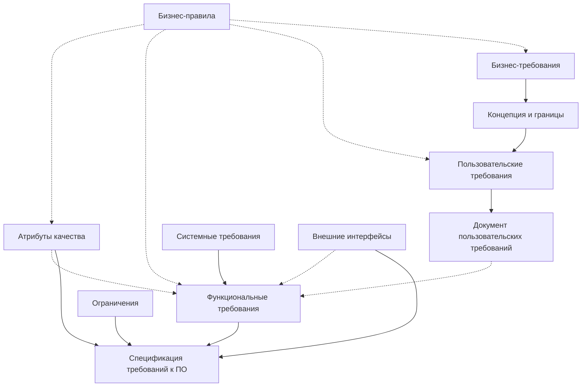

## D02. Разработка требований и управление ими — стр. 9

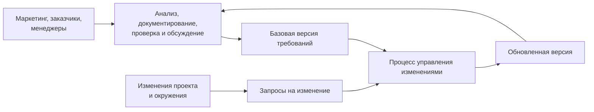

## D03. Итерационная разработка требований — стр. 10

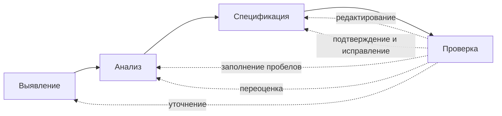

## D04. Разработка требований по итерациям — стр. 14

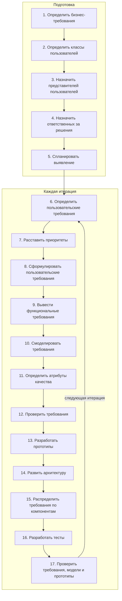

## D05. Выявление требований — стр. 19

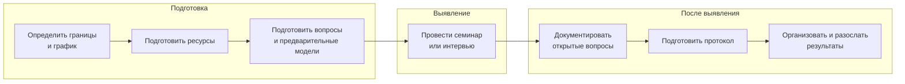

## D06. Типы информации о требованиях — стр. 20

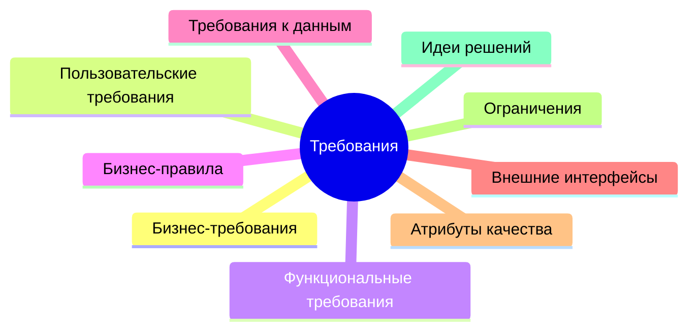

## D07. Варианты использования системы учета химикатов — стр. 22

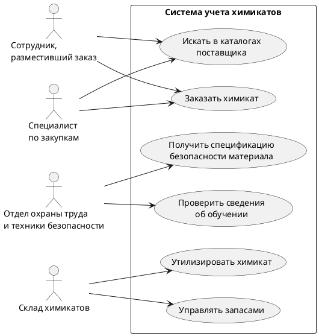

## D08. От варианта использования к интерфейсу — стр. 43

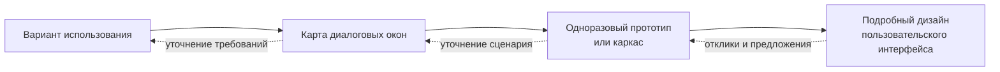

## D09. Экспертиза требований — стр. 47

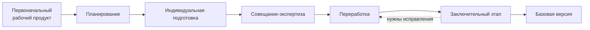

## D10. Обобщение требования для повторного использования — стр. 52

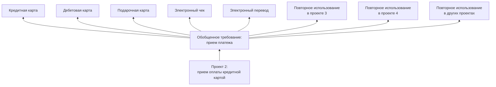

## D11. Области управления требованиями — стр. 54

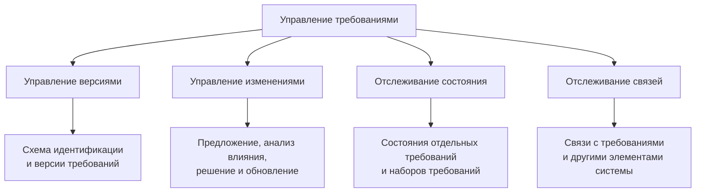

## D12. Жизненный цикл запроса на изменение — стр. 56

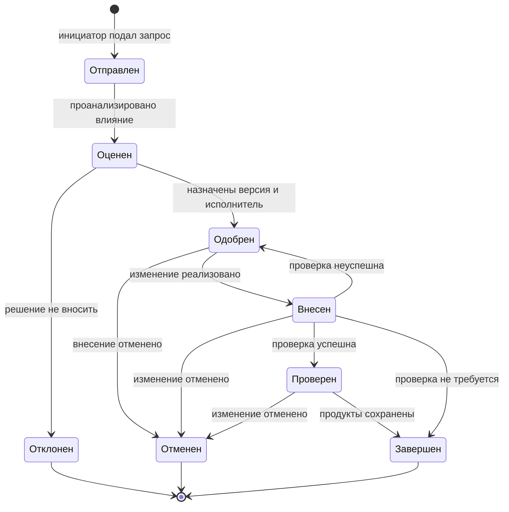

## D13. Сеть трассировки требований — стр. 62

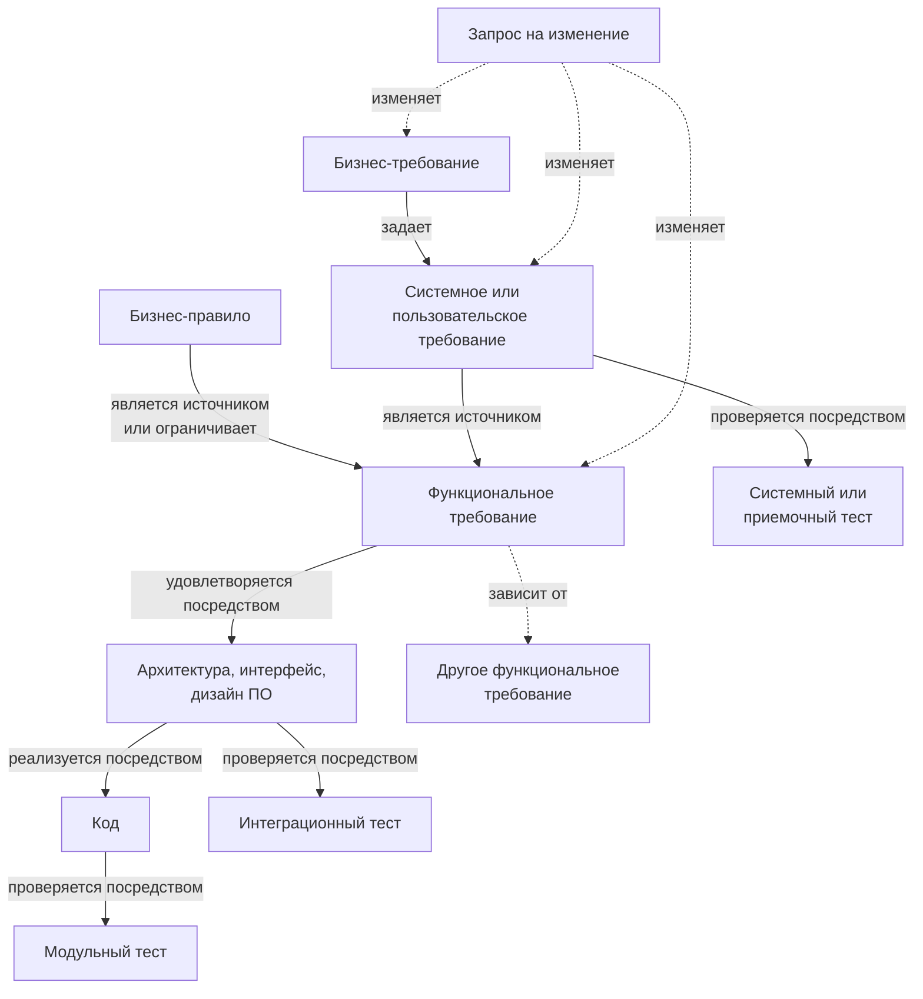

## D14. Модель данных учета химикатов — стр. 68

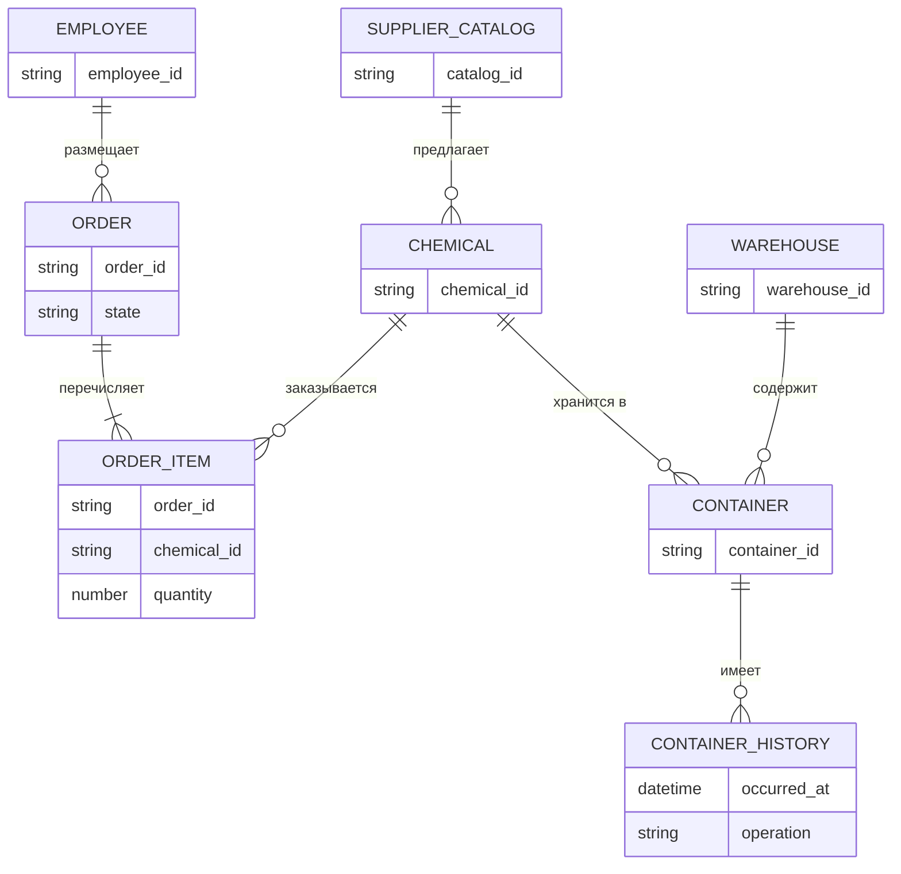

## D15. Состояния заказа химиката — стр. 69

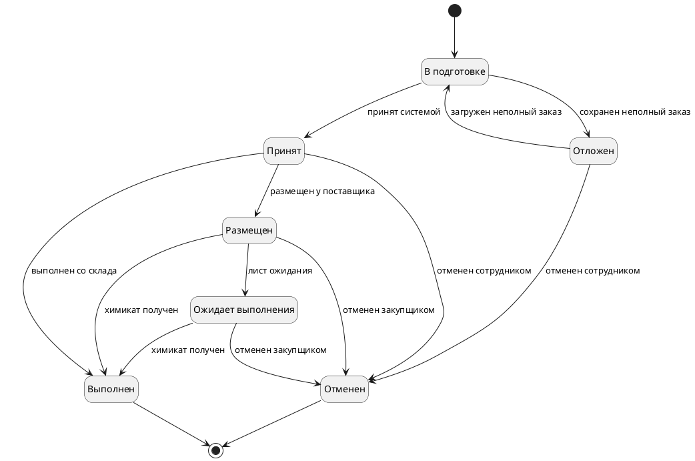

## D16. Карта диалогов заказа химиката — стр. 70

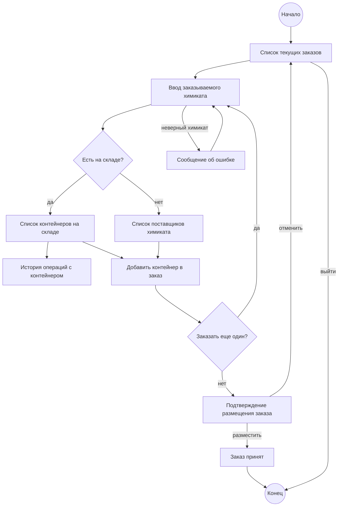

## D17. Дерево решения о заказе — стр. 71

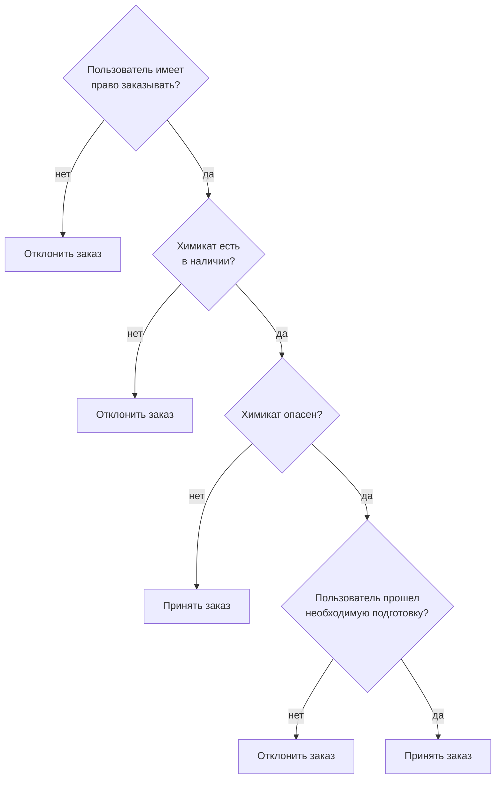

## D18. Источники событий системы — стр. 72

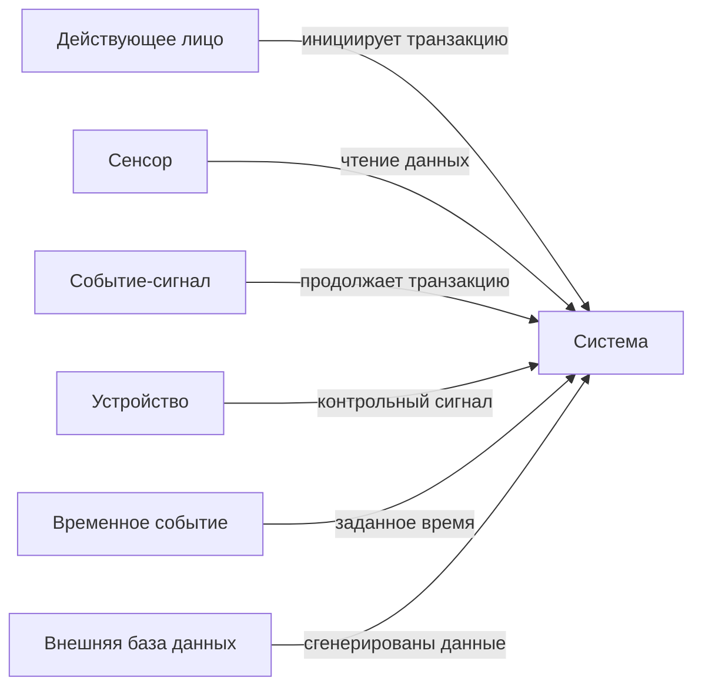
